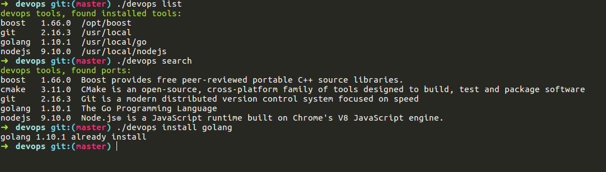

# My Devops Script

## Introduction

devops is some tools install or compile script set.

## Dependencies

This tool need install PowerShell Core, SEE: [Package Installation Instructions](https://github.com/PowerShell/PowerShell/blob/master/docs/installation/linux.md).

## Usage

```txt
Devops utilies 1.0
Usage: devops cmd args
       list        list installed tools/libs
       search      search ported tools/libs
       install     install tools or libs
       upgrade     upgrade tools/libs
       version     print devops version and exit
       config      config your secure repository
       help        print help message

```

## Snapshot



## Copyright

Licensed under MIT